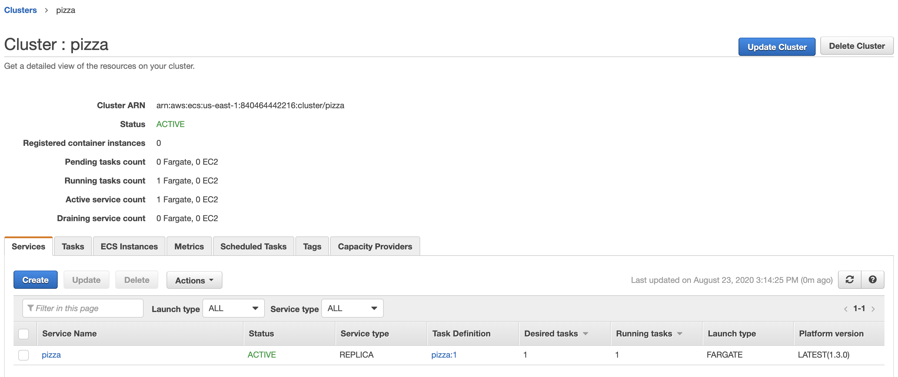
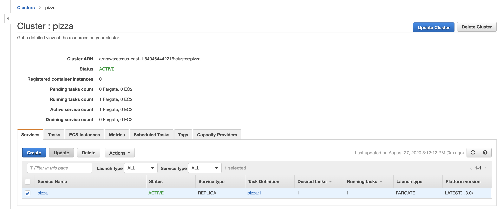
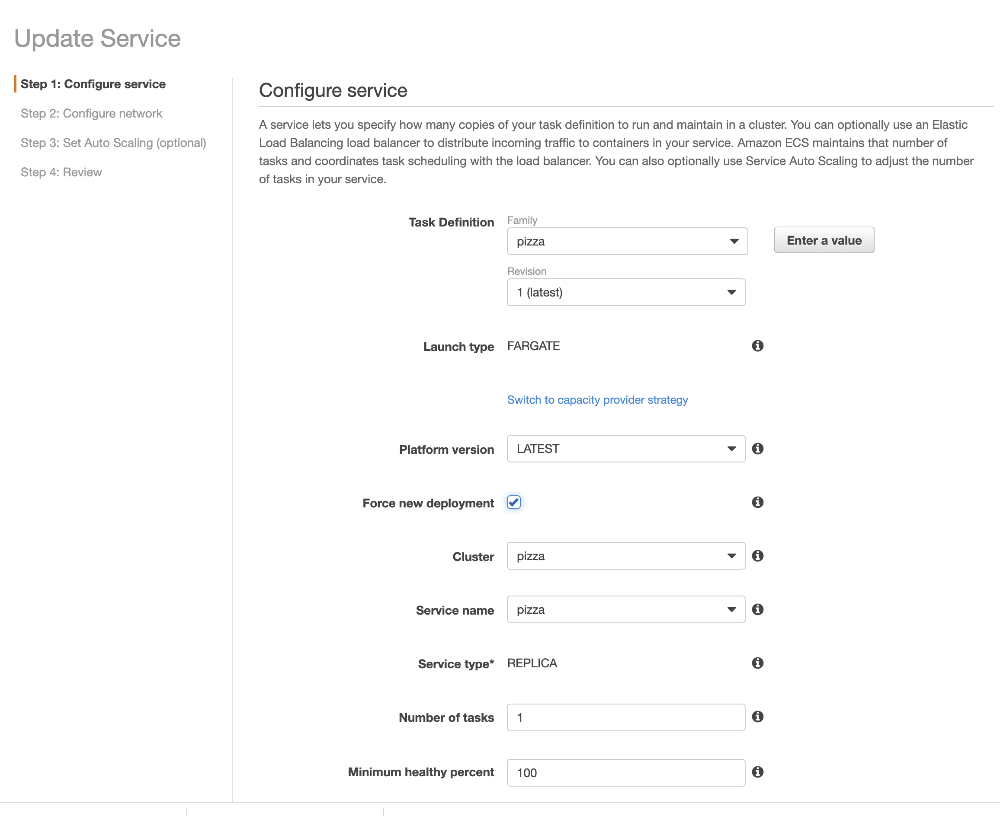
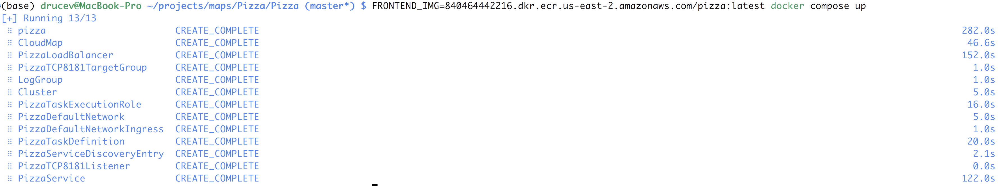

# Deploy a Microservice to AWS Elastic Container Service: The Harder Way and the Easier Way

A while back I made this [Pizza service ](http://www.streeteye.com/static/Pizza/#) weekend project and I thought I could just press a button in AWS and deploy it in the cloud. It turned out to be… more complicated. With the latest version of Docker it's getting easier. Here's the harder (old) way and the easier (new) way. Hopefully in the not too-distant future it will be as simple as saying `docker compose up` without much additional configuration, or just submitting a form pointing to your container repository.

## The harder way

Based on this AWS document: [Tutorial: Creating a Cluster with a Fargate Task Using the Amazon ECS CLI](https://docs.aws.amazon.com/AmazonECS/latest/developerguide/ecs-cli-tutorial-fargate.html)

1) [Install and configure AWS CLI](https://docs.aws.amazon.com/cli/latest/userguide/cli-environment.html)

2) [Install ECS CLI](https://docs.aws.amazon.com/AmazonECS/latest/developerguide/ECS_CLI_installation.html)

3) Assume IAM task execution role if needed:

- Create the file `task-execution-assume-role.json` (see [example](task-execution-assume-role.json). Update region as necessary.) 

```bash

aws iam --region us-east-1 create-role --role-name ecsTaskExecutionRole --assume-role-policy-document file://task-execution-assume-role.json

```


- Attach role policy:

```bash

aws iam --region us-east-1 attach-role-policy --role-name ecsTaskExecutionRole --policy-arn arn:aws:iam::aws:policy/service-role/AmazonECSTaskExecutionRolePolicy

```

4) Configure credentials and default cluster:


```bash
ecs-cli configure profile --access-key <access-key> --secret-key <secret-key> --profile-name pizza-profile
INFO[0000] Saved ECS CLI profile configuration default.

ecs-cli configure --cluster pizza --default-launch-type FARGATE --config-name pizza --region us-east-1
INFO[0000] Saved ECS CLI cluster configuration pizza.

ecs-cli up --cluster-config pizza --ecs-profile pizza-profile
INFO[0000] Created cluster                               cluster=pizza region=us-east-1
INFO[0061] Waiting for your cluster resources to be created...
INFO[0062] Cloudformation stack status                   stackStatus=CREATE_IN_PROGRESS
INFO[0122] Cloudformation stack status                   stackStatus=CREATE_IN_PROGRESS
VPC created: vpc-123456789012e1234
Subnet created: subnet-1234567890abcdef
Subnet created: subnet-fedcba0987654321
Cluster creation succeeded.
```

Note that this doesn't create your own personal cluster but takes advantage of the Fargate container service.

Take note of info on cluster VPC and subnets reported.

Get security group
```bash

aws ec2 describe-security-groups --filters Name=vpc-id,Values=vpc-123456789012e1234 --region us-east-1

```
Take note of e.g. `"GroupId": "sg-1111222233334444"`

5) Configure security group to allow inbound on the desired port, using the security group-id reported (and correct port and region):
```bash
aws ec2 authorize-security-group-ingress --group-id sg-1111222233334444 --protocol tcp --port 8181 --cidr 0.0.0.0/0 --region us-east-1

```

6) Create container repository 
```bash
aws ecr create-repository --repository-name pizza
aws ecr describe-repositories

```
Take note of repo URI.

7) Push Docker image to ECR (replace with your repo URI, region):
```bash
aws ecr get-login-password --region us-east-1 | docker login -u AWS --password-stdin 123412341234.dkr.ecr.us-east-1.amazonaws.com
docker build . -t pizza
docker tag pizza:latest 123412341234.dkr.ecr.us-east-1.amazonaws.com/pizza:latest
docker push 123412341234.dkr.ecr.us-east-1.amazonaws.com/pizza:latest

```

8) Start the container:

- Make docker-compose.yml file (see [example](ecs-docker-compose.yml). Specify correct ECR image and region)
- Make ecs-params.yml file (see [example](ecs-params.yml). Specify correct subnets and security group)

```bash

ecs-cli compose --project-name pizza service up --create-log-groups --cluster-config pizza --ecs-profile pizza-profile

```

This will take a minute and show some log messages.

```bash

INFO[0000] Using ECS task definition                     TaskDefinition="pizza:1"
INFO[0000] Auto-enabling ECS Managed Tags
INFO[0016] (service pizza) has started 1 tasks: (task cc0dce4d34054f63b3c734b7d9071189).  timestamp="2020-08-23 19:11:14 +0000 UTC"
INFO[0066] Service status                                desiredCount=1 runningCount=1 serviceName=pizza
INFO[0066] ECS Service has reached a stable state        desiredCount=1 runningCount=1 serviceName=pizza
INFO[0066] Created an ECS service                        service=pizza taskDefinition="pizza:1"

```

Go to AWS Elastic Container Service console and you should see your cluster running.



9) Get info on your container:
```bash
ecs-cli compose --project-name pizza service ps --cluster-config pizza --ecs-profile pizza-profile
Name                                              State    Ports                        Task          Definition
Healthpizza/0fec210e48734bf1bfca123a88e3a2f1/web  RUNNING  3.237.198.63:8181->8181/tcp  pizza:1       UNKNOWN

```

Note the IP address and port. You should now be able to access the service on IP:port. For pizza try
http://3.237.198.63:8181/query?location=brooklynheights&keyword=pizza
										    

Note the task id and view logs
```bash

ecs-cli logs --task-id 0fec210e48734bf1bfca123a88e3a2f1 --follow --cluster-config pizza --ecs-profile pizza-profile

```

10) Update the docker image
```bash

docker login -u AWS -p $(aws ecr get-login-password --region us-east-1) 123412341234.dkr.ecr.us-east-1.amazonaws.com
docker build . -t pizza
docker tag pizza:latest 123412341234.dkr.ecr.us-east-1.amazonaws.com/pizza:latest
docker push 123412341234.dkr.ecr.us-east-1.amazonaws.com/pizza:latest

```

- Go to ECS console https://console.aws.amazon.com/ecs/home?region=us-east-1
- Click on cluster e.g. pizza
- Click on service checkbox for Pizza
- Choose 'Update' from dropdown
- On next page click 'Force new deployment', and leave other settings the same , and Update Service




11) Shut it down:
```bash

ecs-cli compose --project-name pizza service down --cluster-config pizza --ecs-profile pizza-profile

```

## The easier way

Docker and AWS have been working to integrate and streamline this process. In theory, modulo configuring region and credentials, you should be able to say `docker compose up` and run all the above steps automatically.

#### Prerequisites

1) As of this writing (9/2020) you need the Edge Docker Release ([Mac](https://docs.docker.com/docker-for-mac/edge-release-notes/) or [Windows](https://docs.docker.com/docker-for-windows/edge-release-notes/))
		 
2) You need a default VPC in your EC2 region. If you have a newer AWS account this should be set up by default. If you have an ancient AWS account you may need to [convert from EC2-Classic to VPC](https://docs.aws.amazon.com/AWSEC2/latest/UserGuide/vpc-migrate.html#convert-ec2-classic-account), or use a new region with no old-style resources.

3) Enable new ARN format: [see here](https://us-east-1.console.aws.amazon.com/ecs/home?region=us-east12#/settings).

#### Steps

1) Create a new AWS CLI profile for ECS (access key, secret, region, output format e.g. JSON)
```bash

aws configure --profile ecs

```

2) Create a Docker context for ecs
```bash

docker context create ecs ecs

```

Choose your AWS named profile created above i.e. `ecs`.

Type your region e.g. `us-east-1`

Hit enter a couple of times.

```bash

(base) drucev@MacBook-Pro ~/projects/dockertest/docker-ecs-compose (main*) $ docker context create ecs ecs
? Select AWS Profile ecs
? Region us-east-1
? Enter credentials No
Successfully created ecs context "ecs"

```

Now you can switch between docker profiles with
```bash
		   
docker context use ecs
docker context use default

```

See https://docs.docker.com/engine/reference/commandline/context/ .

3) Build the Docker image similar to above:
```bash
   
docker context use default
docker build . -t pizza
docker tag pizza:latest 123412341234.dkr.ecr.us-east-1.amazonaws.com/pizza:latest

```

4) Push to Elastic Container Repository similar to above
```bash

aws ecr get-login-password --region us-east-1 | docker login -u AWS --password-stdin 123412341234.dkr.ecr.us-east-1.amazonaws.com
aws ecr create-repository --profile ecs --repository-name pizza
docker push 123412341234.dkr.ecr.us-east-1.amazonaws.com/pizza:latest

```

5) Create `docker-compose.yml`. See [new-docker-compose.yml](new-docker-compose.yml), which specifies image: $(FRONTEND_IMG). (or you can hard-code it.) Rename or copy to docker-compose.yml.
```bash

version: "3.8"
services:
  pizza:
    image: ${FRONTEND_IMG}
    ports:
      - "8181:8181"

```

If you previously created the 'pizza' app, go to the ECS console and delete the existing cluster and task. Run the image with:
```bash

docker context use ecs
FRONTEND_IMG=123412341234.dkr.ecr.us-east-1.amazonaws.com/pizza:latest docker compose up

```

This will take a couple of minutes but should run all the steps specified above.



You can then do 

```bash

docker compose ps
ID                                NAME                REPLICAS            PORTS
pizza-PizzaService-9UKSYVKGPMX8   pizza               1/1                 PizzaLoadBalancer-c4f8d3de53d346be.elb.us-east-2.amazonaws.com:8181->8181/tcp

```

You should be able to connect to your service on the specified port. It may take a minute for DNS to propagate.

You can also do:

```bash

docker compose logs
FRONTEND_IMG=123412341234.dkr.ecr.us-east-1.amazonaws.com/drucev/pizza:latest docker compose convert
docker compose down

```

`docker compose convert` outputs the CloudFormation JSON to run the container in the ECS service, with all the network setup, security group and rules etc.


That's it! Deploying a public container still seems a little rough around the edges but it's getting better.
